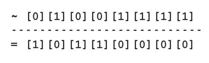
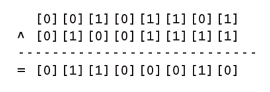
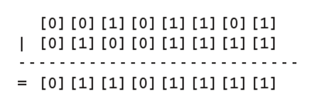
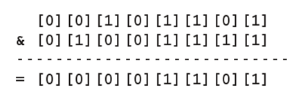
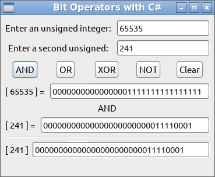
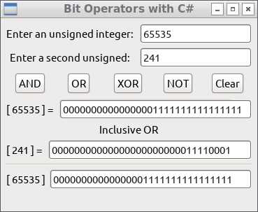
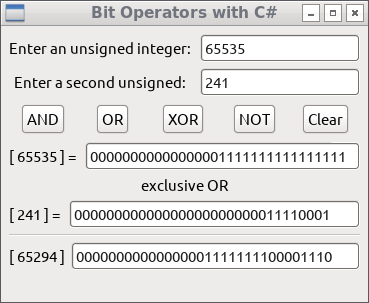
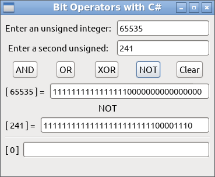

# Understanding Bitwise Logical Operators with C#
        

            Bit manipulation operations, including logical and shift operations, perform low-level operations directly on the binary representations used in integers. The ability to operate directly on binary might save large amounts of memory, might enable certain computations to be performed very efficiently, and can greatly simplify operations on collections of bits, such as data read form or written to parallel I/O ports.
            

            

            The C# programming language supports bitwise operations on both numeric and boolean data types. These are represented as the operators ~, &amp;, ^, and | for the bitwise operations of NOT (bitwise complement), bitwise AND, bitwise XOR, and bitwise OR, respectively.
            The operators work in parallel on all bits of the operands and never cause overflow, even in a checked context.
            

            

            Unsigned integers are normally used with the bitwise operators.
            

            <h3>Bitwise NOT (complement)</h3>
            
The bitwise complement or NOT is used to flip the bits of a value, this operator is unary and inverts the bit value. Since this operator is a unary operator it cannot be combined with the = sign.

            
<b>Fig 1 Example of bitwise NOT operator</b>
 
            

 
            <h3>Bitwise XOR</h3>
            

            When combining two values with the logical XOR bitwise operator, you get the following result: if both bits are the same, the result is 0 else if 1 bit is 0 and the other is 1, the result is 1
            

            
<b>Fig 2 Example of bitwise XOR Operator</b>
 
            

 
            <h3>Bitwise OR</h3>
            

            When combining 2 byte values results in the following: if both bits are 0, the result is 0. If either or both bits are 1, the result is 1.
            

            
<b>Fig 3 Example of bitwise OR operator</b>
 
            

 
            <h3>Bitwise AND</h3>
            
The bitwise AND operator produces a one in the output bit if both input bits are one; otherwise it produces a zero.

            
<b>Fig 4 Example of bitwise AND operator</b>
 
            

 
            

            When using the bitwise operator, it’s useful to display values in binary to show the precise effects of these operators.
            The following example demonstrate the use of the bitwise operators, you can download the source code from <a href="">here</a>. 
            

            

            The application sample is shown below:
            

            
<b>Fig 1 Testing the AND operator</b>
 
            

 
            
<b>Fig 2 Testing the Inclusive OR operator</b>
 
            

 
            
<b>Fig 3 Testing the exclusive OR operator</b>
 
            

 
            
<b>Fig 4 Testing the NOT operator, this operator is unary, so there is not result using two integers.</b>
 
            

